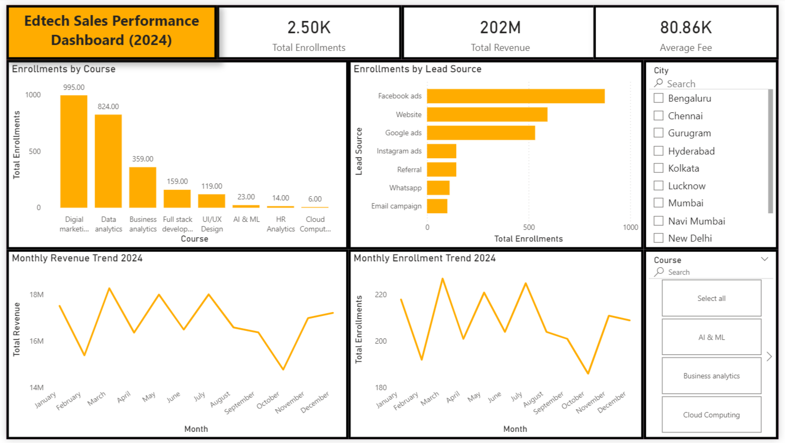

# EdTech Sales & Revenue Performance Analysis (2024)
End-to-end Business Analysis project using SQL, Power BI & Excel to extract actionable insights from EdTech sales data for the year 2024.

## Project Overview
This project analyzes 2024 enrollment and revenue data of an EdTech organization to identify key business drivers using SQL, Power BI & Excel.
The objective was to extract meaningful insights from raw sales data and convert them into actionable business intelligence that supports revenue growth, marketing optimization, and strategic decision-making.
The analysis focuses on course performance, geographic demand, monthly trends, and revenue concentration patterns.

## Business Problem Statement
The management team wanted answers to the following key questions:
- Which course generates the highest revenue?
- Which city contributes the most enrollments?
- What is the total revenue generated?
- Which month recorded the highest revenue?
- How are enrollments distributed across cities?
The goal was to enable data-driven business decisions instead of relying on assumptions.

## Dataset Description
The dataset contains structured enrollment-level transactional data including:
- Record ID
- Enrollment ID
- Student ID
- Gender
- Age
- Enrollment Date
- Enrollment Status
- Lead Source
- Course
- Fees
- City
The data was initially prepared in Excel and then exported to PostgreSQL for analysis.

## Tools & Technologies Used
**Microsoft Excel** – Data cleaning and preparation
**PostgreSQL** – Data analysis using SQL
**Power BI** – Dashboard creation and visualization

## Key KPIs Identified
- Total Enrollments
- Total Revenue
- Average revenue
- Revenue by Course
- City-wise Enrollment Performance
- Monthly Enrollment Trend
- Monthly Revenue Trend
- Gender Distribution

## SQL Analysis Performed
The following SQL operations were performed:
- Data aggregation using COUNT() and SUM()
- Revenue calculation for enrolled students only
- GROUP BY() for course-wise and city-wise analysis
- DATE_TRUNC() for monthly trend analysis
- Sorting and ranking using ORDER BY()
- Revenue breakdown by city and course combination
The analysis ensured accurate filtering using **enrollment_status = 'Enrolled'** to calculate actual revenue.

## Dashboard Overview
An interactive Power BI dashboard was created to visualize:
- Total Revenue KPI
- Total Enrollment KPI
- Average revenue KPI
- Course-wise enrollment
- Enrollment by lead source
- City-wise Enrollment Distribution
- Monthly Revenue Trend
- Monthly Enrollment Trend
- 

## Key Findings
- Total Revenue Generated: ₹20,20,57,238
- Top Performing Course: Digital Marketing
- Top Contributing City: Bengaluru
- Highest Revenue Month: March
Additional Insights:
- Revenue is heavily concentrated among top-performing courses.
- Certain cities do not contribute heavily to enrollments.
- Revenue spikes indicate seasonal demand patterns.
- Digital Marketing dominates both enrollment and revenue metrics.

## Business Recommendations
Based on the analysis:
- Increase marketing budget allocation for other lower performing courses.
- Focus performance campaigns in Bengaluru to maximize ROI.
- Analyze March campaigns to replicate high-performing strategies.
- Develop growth strategies for underperforming cities.
- Introduce bundled offers or pricing optimization for low selling courses.

## Conclusion
This analysis successfully transformed raw enrollment data into structured business intelligence insights. 
By leveraging SQL for structured querying and Power BI for visualization, the project demonstrates how data can drive strategic business decisions, revenue optimization, and targeted marketing initiatives. The project highlights strong analytical thinking, business understanding, and data storytelling capabilities aligned with a Business Analyst role.

## Repository Structure
```EdTech-Sales-Analysis/
│
├── Dataset/
│   └── edtech_sales_data.xlsx
│
├── SQL/
│   └── edtech_sales_analysis.sql
│
├── PowerBI/
│   └── edtech_dashboard.pbix
│
├── screenshots/
│   └── dashboard.png
│
└── README.md
```
